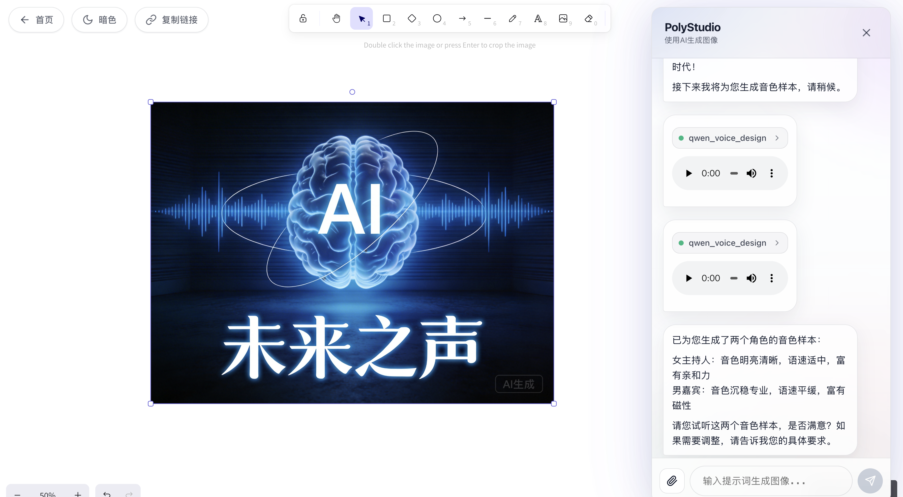

# 🎨 PolyStudio

[Python 3.9+](https://www.python.org/downloads/) | [Node.js 18+](https://nodejs.org/) | [License: MIT](https://opensource.org/licenses/MIT)

PolyStudio 是一个对话式多模态内容生成平台，将语言模型与专业工具（如图片生成、视频生成、3D 模型生成）相结合，通过自然语言对话即可生成和管理多媒体内容。项目采用 FastAPI + LangGraph 构建智能 Agent 编排系统，提供无限画板承载与项目管理，支持 SSE 流式输出、自动内容插入、项目链接分享等功能。

PolyStudio 支持灵活的 API 接入，你可以轻松替换为任意图片、视频、3D 生成服务，打造属于自己的多模态创作工具。

### 功能概览

- **智能播客生成**：从脚本创作到混音输出的完整音频内容生成工作流 🆕
  - 支持播客、有声书、广播剧等多种音频场景
  - 基于文本描述或参考音频的 AI 语音合成（Qwen-TTS）
  - 音色样本试听确认，确保声音满意后再批量合成
  - 智能 BGM 匹配与混音（支持 BGM 开场效果）
  - 自动音频拼接与专业后期处理
- **虚拟人生成**：支持图片 + 音频生成口型同步的虚拟主播视频，基于 ComfyUI 工作流，支持 OpenCV 或 LLM 两种人脸检测方式进行质量验证 🆕
- **音频上传与管理**：前端支持音频文件上传（MP3/WAV/M4A 等格式），在对话中可视化展示，保存到本地 🆕
- **长视频工作流**：角色一致性分镜生成 → 生图 → 图生视频 → 拼接的完整流程，兼容 moviepy 2.x 🆕
- **路径自动处理**：视频工具支持本地/公网/localhost 路径自动处理（含 base64 转换与下载） 🆕
- **统一 Mock 模式**：图片/视频/3D/虚拟人工具统一 Mock 模式，便于离线或调试 🆕
- **SSE 流式输出优化**：实时推送 delta、工具调用与结果 🆕
- **对话式生成/编辑图片**：支持图片生成和编辑，可替换为任意图片生成 API
- **视频生成**：支持基于文本、图片或首尾帧生成视频，支持图片 URL 和本地路径输入（本地路径如 `/storage/images/xxx.jpg` 会自动转换为 base64），可替换为任意视频生成 API
- **3D 模型生成**：支持基于文本或图片生成 3D 模型（OBJ/GLB 格式），可替换为任意 3D 生成 API
- **无限画板**：生成的图片和视频自动插入画布，支持缩放/对齐/框选/编辑等，视频双击可播放
- **3D 模型查看器**：前端集成 3D 模型预览功能，支持 OBJ/GLB 格式，双击可预览
- **项目管理**：项目列表、重命名、复制链接、删除
- **全局主题切换**：前端与画板支持深色和浅色模式，默认深色
- **本地持久化**：图片保存到 `backend/storage/images/`，视频保存到 `backend/storage/videos/`，音频保存到 `backend/storage/audios/`，播客保存到 `backend/storage/podcasts/`，BGM 保存到 `backend/storage/bgm/`，3D 模型保存到 `backend/storage/models/`（包含 OBJ、MTL、纹理文件），项目与聊天记录保存到 `backend/storage/chat_history.json`


### 界面展示

#### 首页


#### 编辑页




#### 虚拟人效果展示

<table>
  <tr>
    <td width="33%" align="center">
      <a href="assets/虚拟人效果1.mp4">
        
      </a>
      <p>点击查看虚拟主播示例1</p>
    </td>
    <td width="33%" align="center">
      <a href="assets/虚拟人效果2.mp4">
        
      </a>
      <p>点击查看虚拟主播示例2</p>
    </td>
    <td width="33%" align="center">
      <a href="assets/虚拟人效果3.mp4">
        
      </a>
      <p>点击查看虚拟主播示例3</p>
    </td>
  </tr>
</table>

> 💡 提示：点击上方图片可下载/查看对应的虚拟人视频演示


### 目录结构

```
PolyStudio/
├── backend/                 # FastAPI 后端
│   ├── app/                 # 业务代码
│   │   ├── tools/           # 工具模块
│   │   │   ├── qwen_tts.py          # Qwen-TTS 语音合成（声音设计、声音复刻）🆕
│   │   │   ├── audio_mixing.py     # 音频混音工具（拼接、BGM、混音）🆕
│   │   │   ├── volcano_image_generation.py  # 图片生成/编辑
│   │   │   ├── volcano_video_generation.py  # 视频生成
│   │   │   ├── model_3d_generation.py       # 3D模型生成
│   │   │   ├── virtual_anchor_generation.py # 虚拟人生成
│   │   │   └── video_concatenation.py       # 视频拼接
│   │   ├── services/        # 服务模块
│   │   │   ├── agent_service.py    # Agent服务
│   │   │   ├── prompt.py           # Agent提示词（模块化）🆕
│   │   │   └── stream_processor.py # 流式处理
│   │   └── utils/           # 工具函数（日志配置等）
│   ├── requirements.txt     # Python 依赖（以此为准）
│   ├── start.sh             # 推荐的后端启动脚本（确保用正确的 Python 环境）
│   ├── scripts/             # 维护脚本（如存量图片归一化）
│   ├── storage/              # 运行数据
│   │   ├── images/          # 生成的图片
│   │   ├── videos/          # 生成的视频
│   │   ├── audios/          # 上传的音频 + TTS生成的音频 🆕
│   │   ├── podcasts/        # 混音后的播客成品 🆕
│   │   ├── bgm/             # 背景音乐库（文件名作为场景描述）🆕
│   │   ├── models/          # 生成的3D模型（OBJ、MTL、纹理文件）
│   │   └── chat_history.json # 聊天历史记录
│   └── logs/                # 日志文件（按日期和大小自动轮转）
├── frontend/                # React + Vite 前端
│   ├── src/components/      # ChatInterface / ExcalidrawCanvas / Model3DViewer / HomePage
│   └── vite.config.ts       # /api、/storage 代理
└── README.md                # 项目说明文档
```

### 快速开始

#### 环境要求

- **Python**：3.9+
- **Node.js**：18+

#### 后端启动（FastAPI）

0) （推荐）创建并进入 conda 环境：

```bash
conda create -n agentImage python=3.11 -y
conda activate agentImage
```

> 注意：`backend/start.sh` 默认会 `conda activate agentImage`。如果你用别的环境名，请同步修改该脚本里的环境名。

1) 安装依赖：

```bash
cd backend
pip install -r requirements.txt
```

> **注意**：播客生成功能需要安装 `pydub`（已包含在 requirements.txt 中）。如果单独安装：`pip install pydub`

2) 配置环境变量（必需）：在 `backend/.env` 写入（详见 `env.example`）

推荐方式：

```bash
cd backend
cp env.example .env
# 然后编辑 .env 文件，填入必要的 API Key
```

**必需的环境变量：**
- `OPENAI_API_KEY`：LLM API 密钥（用于对话模型，当 `LLM_PROVIDER=siliconflow` 时使用）
- 图片/视频生成 API 密钥（根据你使用的 API 提供商配置，如 `VOLCANO_API_KEY` 等）
- 3D 模型生成 API 密钥（根据你使用的 API 提供商配置，如 `TENCENT_AI3D_API_KEY` 等）

**TTS语音合成配置（播客生成）：** 🆕
- `DASHSCOPE_API_KEY`：阿里云百炼 API 密钥（用于 Qwen-TTS 语音合成）
- `DASHSCOPE_BASE_URL`：API 地址，国内版：`https://dashscope.aliyuncs.com`

**虚拟人生成配置（可选）：**
- `COMFYUI_SERVER_ADDRESS`：ComfyUI 服务器地址（用于虚拟人生成）
- `COMFYUI_WORKFLOW_PATH`：ComfyUI 工作流文件路径（JSON 格式）
- `FACE_DETECTION_METHOD`：人脸检测方式，可选值：`opencv`（默认）、`llm`

**其他可选环境变量：**
- `LLM_PROVIDER`：LLM 提供商，可选值：`volcano`（默认）、`siliconflow`
- `MOCK_MODE`：设置为 `true` 启用 Mock 模式（调试用，不调用真实 API）
  - 启用 Mock 模式时，必须同时配置 `MOCK_IMAGE_PATH`、`MOCK_VIDEO_PATH`、`MOCK_MODEL_PATH` 和 `MOCK_VIRTUAL_ANCHOR_PATH`
- `LOG_LEVEL`：日志级别（DEBUG, INFO, WARNING, ERROR, CRITICAL，默认：INFO）

3) 启动后端（推荐）：

```bash
cd backend
chmod +x start.sh
./start.sh
```

或直接：

```bash
cd backend
python -m uvicorn app.main:app --reload --host 0.0.0.0 --port 8000
```

后端默认地址：`http://localhost:8000`

#### 前端启动（Vite）

```bash
cd frontend
npm install
npm run dev
```

前端默认地址：`http://localhost:3000`

`frontend/vite.config.ts` 已配置代理：
- `/api` -> `http://localhost:8000`
- `/storage` -> `http://localhost:8000`

#### BGM 配置（播客生成可选） 🆕

如果需要使用播客生成功能的 BGM 混音，需要在 `backend/storage/bgm/` 目录添加背景音乐文件：

```bash
cd backend/storage/bgm/
# 添加 MP3/WAV 文件，文件名作为场景描述，例如：
# 欢快的开场音乐.mp3
# 科技感电子音乐.mp3
# 轻松聊天背景.mp3
# 深沉专业讨论.mp3
```

Agent 会根据播客主题智能匹配最合适的 BGM。

### 技术栈/服务说明（以代码为准）

- **LLM（对话模型）**：支持多种提供商，可通过 `LLM_PROVIDER` 配置切换，可扩展为任意 OpenAI 兼容接口
- **智能播客生成**：完整的音频内容生成工作流 🆕
  - **语音合成**：基于阿里云百炼 Qwen-TTS，支持声音设计（文本描述音色）和声音复刻（参考音频克隆）
  - **音色确认**：生成音色样本供用户试听，确认满意后再批量合成
  - **音频处理**：基于 pydub，支持音频拼接、BGM 匹配、专业混音
  - **BGM 效果**：支持 BGM 开场效果（原声播放3秒后平滑过渡到5%背景音量）
  - **智能匹配**：根据播客主题和场景描述，从 BGM 库中智能匹配合适的背景音乐
- **图像生成/编辑**：后端工具调用图片生成 API（结果下载保存到本地 `/storage/images`），可替换为任意图片生成服务
- **视频生成**：后端工具调用视频生成 API，支持文本、图片或首尾帧生成模式，生成的视频保存到本地 `/storage/videos`，支持图片 URL 和本地路径输入（本地路径和 localhost URL 会自动转换为 base64，公网 URL 直接使用），支持自定义视频参数（时长、宽高比等）
- **3D 模型生成**：后端工具调用 3D 生成 API，支持文本、图片或混合模式，生成的模型保存到本地 `/storage/models/`，可替换为任意 3D 生成服务
- **虚拟人生成**：基于 ComfyUI 集成，支持图片 + 音频生成口型同步的虚拟主播视频
  - 支持两种人脸检测方式：OpenCV（快速）或 LLM（精准）
  - 自动上传图片和音频到 ComfyUI 服务器
  - 轮询任务状态，生成完成后自动下载并保存到本地
  - Mock 模式支持，便于调试
- **音频处理**：支持前端上传音频文件（MP3/WAV/M4A/AAC/OGG/FLAC/WMA），保存到 `backend/storage/audios/`，在对话中可视化展示
- **颜色一致性**：后端保存图片时会尝试做 sRGB 归一化（依赖 `Pillow`，已在 `requirements.txt` 固定）
- **日志系统**：统一的日志配置，支持输出到控制台和文件（`backend/logs/`），可按日期和大小自动轮转
- **Mock 模式**：支持启用 Mock 模式用于调试，返回固定的图片、视频、3D 模型和虚拟人数据，无需调用真实 API
  - 启用方式：在 `.env` 中设置 `MOCK_MODE=true`
  - 必须配置：`MOCK_IMAGE_PATH`、`MOCK_VIDEO_PATH`、`MOCK_MODEL_PATH`、`MOCK_VIRTUAL_ANCHOR_PATH`（分别指向 `/storage/` 下的实际文件路径）

### 使用示例 🆕

#### 生成播客

```
用户：生成一个3分钟的AI主题播客，主持人和嘉宾对话

Agent工作流：
1. 生成对话脚本（主持人和嘉宾的完整对话内容）
2. 音色设计：
   - 为主持人生成音色样本（"亲切的女声"）
   - 为嘉宾生成音色样本（"专业的男声"）
   - 询问："请试听音色样本，是否满意？"
3. 用户确认后，批量合成所有对话（使用相同音色保持一致性）
4. 智能匹配BGM（"科技感电子音乐"）
5. 拼接所有音频片段
6. 混音处理（BGM开场3秒 → 平滑过渡到5%背景音量）
7. 输出完整播客音频
```

### 常见问题（简版）

- **建议不要手动混装 langchain 版本**：以 `backend/requirements.txt` 为准安装，避免出现导入错误/版本不兼容。

